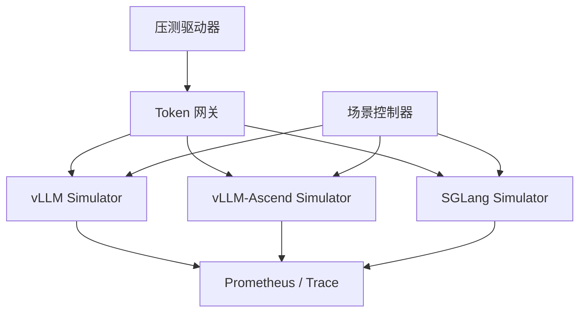
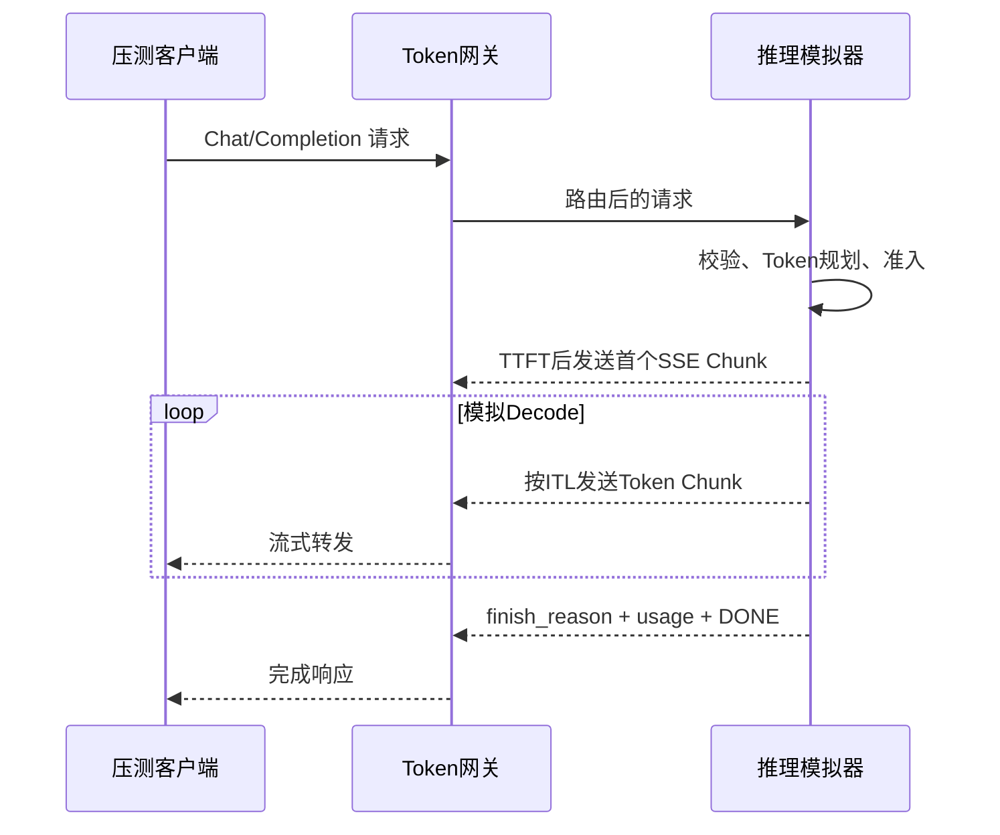

# 基于 llm-d-inference-sim 的推理引擎流量模拟设计方案

> 文档版本：v1.0  
> 编制日期：2026-09-18  
> 验证基线：llm-d-inference-sim v0.11.2（截至编制日期的最新稳定版）  
> 适用范围：Token 网关功能验证、容量压测、稳定性压测、故障与降级验证  
> 基础项目：[llm-d-inference-sim](https://github.com/llm-d/llm-d-inference-sim)

---

## 1. 背景

Token 网关需要面对 vLLM、vLLM-Ascend、SGLang 等多种推理引擎，并承担模型路由、鉴权、限流、Token 计量、计费、流式转发、超时、重试、熔断、故障转移和可观测性等职责。

如果在压测过程中直接调用真实推理引擎，将产生以下问题：

- 大量占用 GPU/NPU，测试成本高。
- 推理性能受模型、硬件、批处理、KV Cache 和调度状态影响，测试结果难以稳定复现。
- 很难持续制造 429、超时、半途中断、usage 缺失等异常场景。
- 网关自身瓶颈可能被真实引擎吞吐瓶颈掩盖。
- 大规模并发和长时间流式连接测试会影响生产或共享测试集群。

因此，本方案基于 `llm-d-inference-sim` 构建一套 CPU-only 推理引擎流量模拟平台，在不加载模型权重、不使用 GPU/NPU 的情况下，模拟推理引擎的协议、Token 数量、响应内容、时延、排队、缓存、负载退化及故障行为。

---

## 2. 建设目标

### 2.1 功能目标

1. 模拟 vLLM、vLLM-Ascend 和 SGLang 的常用推理接口。
2. 支持非流式 JSON 和流式 SSE 响应。
3. 支持可控的输入 Token、输出 Token、缓存 Token 和推理 Token。
4. 生成无实际语义但格式合法的随机文本、JSON、Reasoning 和 Tool Call 响应。
5. 模拟 TTFT、TPOT/ITL、端到端时延、并发排队和过载。
6. 支持 400、401、404、429、500、503、超时、断流和 usage 异常等故障。
7. 支持通过配置文件、管理接口和测试请求头切换场景。
8. 提供 Prometheus 指标和请求级关联标识。
9. 能够以容器和 Kubernetes 方式部署，不申请 GPU/NPU 资源。

### 2.2 性能目标

- 零延迟模式下，模拟器吞吐应至少达到 Token 网关目标吞吐的 3 倍。
- 支持不少于 2,500 条同时在线的流式连接；更高并发通过横向扩容实现。
- 支持 128K 及以上逻辑上下文，但不要求在内存中保存等量 KV Cache 数据。
- 支持持续 8～24 小时稳定性压测，无连接、协程和内存持续泄漏。

### 2.3 非目标

本方案不用于验证：

- 模型回答质量和正确性。
- GPU/NPU 算子性能。
- 真实显存占用和算子级调度。
- 模型量化精度。
- 真实推理引擎的最终容量结论。

模拟平台测量的是 Token 网关及其周边系统的能力；真实推理引擎容量仍需通过少量真实硬件测试进行校准。

---

## 3. 技术选型结论

### 3.1 主体方案

采用 `llm-d-inference-sim` 作为统一模拟数据面，原因如下：

- Go 实现，数据面轻量，适合高并发流式连接。
- 不需要 GPU 和模型权重。
- 支持随机响应和 Echo 响应。
- 支持 OpenAI 兼容接口、vLLM 扩展接口和流式输出。
- 支持 TTFT、ITL、抖动、负载退化和队列容量配置。
- 支持 Tokenizer、KV Cache、PD 分离、LoRA 和 Prometheus 指标模拟。
- 提供 Docker 镜像、Kubernetes 清单和 Helm Chart。
- Apache-2.0 许可证，适合二次开发。

### 3.2 辅助方案

- SGLang 原生协议高保真验证：使用 [SGLang Simulator](https://docs.sglang.io/docs/advanced_features/sglang_simulator)。
- vLLM 真实调度栈高保真抽测：参考 [LLM-Emu](https://github.com/AKafakA/llm-emu)。
- 容量曲线和调度策略离线分析：参考 [BLIS](https://github.com/inference-sim/inference-sim)。
- 压测流量生成：优先使用 [SGLang bench_serving](https://docs.sglang.io/developer_guide/bench_serving.html)，必要时开发专用 Go 压测器。

### 3.3 基本原则

1. 一套代码，多套引擎 Profile。
2. 协议模拟、性能模拟和故障模拟相互解耦。
3. vLLM-Ascend 复用 vLLM 协议实现，只配置不同性能画像。
4. SGLang OpenAI 兼容接口复用统一接口；SGLang 原生接口增加薄适配层。
5. 容量压测与 Token 精确性测试采用不同 Tokenizer 模式。
6. 模拟器自身的 CPU 瓶颈与虚拟推理引擎容量分离。

---

## 4. 总体架构



### 4.1 组件说明

| 组件 | 职责 |
| --- | --- |
| 压测驱动器 | 生成固定并发、开放式到达率、突发和混合长度请求，解析 SSE，统计 TTFT/ITL/E2E |
| Token 网关 | 被测对象，承担鉴权、路由、计量、计费、限流、熔断和流式转发 |
| vLLM Simulator | 模拟标准 vLLM OpenAI 兼容及 vLLM 扩展接口 |
| vLLM-Ascend Simulator | 复用 vLLM 协议，配置昇腾模型和性能曲线 |
| SGLang Simulator | 模拟 SGLang OpenAI 兼容接口以及二开后的原生接口 |
| 场景控制器 | 管理时延、并发、故障率、Token 长度和当前测试场景 |
| Prometheus/Trace | 采集网关、模拟器和压测端指标，关联请求链路 |

### 4.2 推荐部署拓扑

使用同一个 `llm-d-inference-sim` 镜像，部署为多个独立 Kubernetes Deployment：

```text
llm-sim namespace
├── mock-vllm
│   ├── ConfigMap: profile-vllm.yaml
│   └── Service: mock-vllm:8000
├── mock-vllm-ascend
│   ├── ConfigMap: profile-vllm-ascend.yaml
│   └── Service: mock-vllm-ascend:8000
├── mock-sglang-openai
│   ├── ConfigMap: profile-sglang-openai.yaml
│   └── Service: mock-sglang-openai:8000
├── mock-sglang-native
│   ├── 二开版 SGLang Adapter
│   └── Service: mock-sglang-native:8000
└── vllm-render（可选）
    └── 精确 Tokenizer / Chat Template 服务
```

---

## 5. 接口范围

### 5.1 第一阶段必须支持

| 接口 | vLLM | vLLM-Ascend | SGLang OpenAI | SGLang Native |
| --- | ---: | ---: | ---: | ---: |
| `GET /v1/models` | 是 | 是 | 是 | 可选 |
| `POST /v1/chat/completions` | 是 | 是 | 是 | - |
| `POST /v1/completions` | 是 | 是 | 是 | - |
| `GET /health` | 是 | 是 | 是 | 是 |
| `GET /health/ready` | 是 | 是 | 是 | 适配 |
| `GET /metrics` | 是 | 是 | 是 | 是 |
| `POST /generate` | - | - | - | 二开 |
| `GET /model_info` | - | - | - | 二开 |
| `GET /get_model_info` | - | - | - | 二开兼容别名 |
| `GET /server_info` | - | - | - | 二开 |
| `GET /health_generate` | - | - | - | 二开 |

### 5.2 第二阶段支持

| 接口 | v0.11.2 状态 | 处理方式 |
| --- | --- | --- |
| `POST /v1/responses` | 上游已有 | 直接启用并补充契约测试 |
| `POST /v1/embeddings` | 上游已有 | 直接启用，校验向量维度和usage |
| `POST /v1/messages` | 上游已有 | 直接启用，验证Anthropic SSE事件 |
| `POST /tokenize` | 上游已有 | Dummy与Render模式分别验证 |
| `POST /v1/completions/render` | 上游已有 | 精确Token与路由测试 |
| `POST /v1/chat/completions/render` | 上游已有 | Chat Template与多模态测试 |
| `POST /inference/v1/generate` | 上游已有 | 验证vLLM扩展协议 |
| LoRA加载与卸载接口 | 上游已有 | 验证动态模型注册和网关路由 |
| gRPC `Generate`、`GetModelInfo` | 上游已有 | 网关使用gRPC时纳入测试 |
| `POST /detokenize` | 需要二开 | 按目标引擎响应结构适配 |
| `POST /v1/rerank` | 需要二开 | 返回确定性随机Score |
| `POST /v1/score` | 需要二开 | 返回确定性随机Score或Logit |
| `POST /v1/chat/completions/derender` | 需要二开 | 仅在网关实际依赖时实现 |

### 5.3 版本管理

引擎协议可能随版本变化，因此 Profile 应带版本标识：

```text
vllm-default
vllm-ascend-default
sglang-openai-default
sglang-native-default
```

如果生产环境固定了引擎版本，可以进一步维护：

```text
vllm-<version>
vllm-ascend-<version>
sglang-<version>
```

每个版本保留一组 Golden Response，包括普通响应、流式响应、Tool Call、Reasoning、错误响应和 usage。

---

## 6. 请求处理流程



模拟器内部处理顺序：

1. 解析协议和请求字段。
2. 校验模型、上下文长度、参数和认证条件。
3. 生成请求 ID，读取场景和 Profile。
4. 计算 Prompt Token、计划 Output Token 和缓存命中 Token。
5. 执行最大并发和等待队列准入。
6. 计算 Queue Delay、TTFT、ITL 和故障事件。
7. 生成随机内容或数据集内容。
8. 非流式一次返回，或按 Token/Chunk 流式返回。
9. 输出 `finish_reason`、`usage` 和终止标记。
10. 处理客户端取消并释放虚拟资源。
11. 更新指标和请求日志。

---

## 7. Token 模拟设计

### 7.1 两种运行模式

#### 模式 A：高性能 Dummy Tokenizer

适用于网关容量和稳定性压测：

- 不配置 `render-url`，或显式配置 `render-url: ""`，启用内置 Simulated Tokenizer。
- 不加载 Hugging Face Tokenizer。
- 通过正则或内部轻量算法估算输入 Token。
- 随机拼接内置句子或数据集内容。
- 启动快、CPU 开销低。

`force-dummy-tokenizer` 在 v0.11.x 已弃用，并计划在后续版本移除，因此新配置不应再依赖该参数。

此模式不能作为不同模型 Tokenizer 精确计量的最终依据。

#### 模式 B：精确 Tokenizer / Render

适用于 Token 计量和计费验证：

- 启动 CPU 版 vLLM Render 服务。
- 只加载 Tokenizer、Chat Template 和多模态预处理信息，不执行模型 Forward。
- `llm-d-inference-sim` 通过 `render-url` 调用 Render 服务。
- 可分别准备 Qwen、DeepSeek、GLM 等模型的 Render 实例。

建议把容量压测和精确计量测试分开执行，避免 Tokenizer CPU 消耗污染网关容量结果。

### 7.2 输入 Token

输入 Token 可通过以下方式确定：

| 方式 | 精确度 | 适用场景 |
| --- | ---: | --- |
| Dummy Tokenizer估算 | 中 | 大规模容量压测 |
| vLLM Render | 高 | Chat Template、Tool、多模态计量验证 |
| `/v1/completions`直接传Token ID数组 | 精确 | 固定Prompt Token测试 |
| 二开请求头覆盖 | 精确且快速 | 专项测试 |

建议二开增加以下仅测试环境可用的请求头：

```text
X-Mock-Prompt-Tokens: 4096
X-Mock-Cached-Tokens: 2048
```

### 7.3 输出 Token

`max_tokens` 是上限，不必然等于实际输出长度。上游 `llm-d-inference-sim` 的 Random 模式会在上限内按分布采样输出长度。

测试需要两种行为：

1. **真实停止模式**：在 `max_tokens` 内随机停止，验证网关按实际 usage 计费。
2. **固定长度模式**：设置 `ignore_eos: true`，强制输出到指定 `max_tokens`，验证精确 Token 计量和长连接行为。

如果 Token 网关会过滤 `ignore_eos`，建议二开增加：

```text
X-Mock-Output-Tokens: 1024
X-Mock-Ignore-EOS: true
```

或建立模型别名：

```text
mock-qwen3-out-128
mock-qwen3-out-1024
mock-qwen3-out-4096
```

### 7.4 usage 结构

标准响应至少返回：

```json
{
  "usage": {
    "prompt_tokens": 4096,
    "completion_tokens": 1024,
    "total_tokens": 5120,
    "prompt_tokens_details": {
      "cached_tokens": 2048
    }
  }
}
```

二开后增加推理模型字段：

```json
{
  "completion_tokens_details": {
    "reasoning_tokens": 768
  }
}
```

必须构造以下 usage 场景：

- 正常完整 usage。
- 流式请求最后一个空 `choices` Chunk 返回 usage。
- 非流式响应返回 usage。
- 不请求 `include_usage` 时不返回 usage。
- 客户端中断导致最终 usage 未到达。
- usage 缺失。
- usage 与正文不一致。
- `cached_tokens` 大于0。
- Tool Call、Reasoning 和多 Choice 的 Token 汇总。

---

## 8. 响应内容生成

### 8.1 普通文本

使用以下来源生成内容：

1. 内置安全句子集合。
2. 自定义 SQLite 数据集。
3. ShareGPT 等已脱敏语料。
4. 代码、中文、英文、JSON 等专用语料池。

不建议按随机字符逐字节生成，因为：

- 不同 Tokenizer 下 Token 数不可控。
- 可能生成非法 UTF-8。
- 与真实推理流的文本特征差异过大。

推荐根据请求 ID 和全局 Seed 生成确定性随机结果：

```text
seed = hash(global_seed + request_id + model + scenario)
```

### 8.2 JSON响应

当请求带有 `response_format=json_object` 或 JSON Schema 时，必须返回合法 JSON，不能返回普通随机文本。

示例：

```json
{
  "request_id": "req-123",
  "status": "ok",
  "items": [
    {"id": 1, "value": "simulated"}
  ]
}
```

### 8.3 Tool Call

当请求包含 `tools` 且策略决定调用工具时，返回合法的：

```json
{
  "tool_calls": [
    {
      "id": "call_mock_001",
      "type": "function",
      "function": {
        "name": "get_weather",
        "arguments": "{\"city\":\"Tokyo\"}"
      }
    }
  ]
}
```

流式模式下需要把 `arguments` 拆成多个增量 Chunk。

### 8.4 Reasoning

不同模型和引擎可能使用 `reasoning_content`、`reasoning` 或其他字段。建议通过 Profile 指定：

```yaml
response_extensions:
  reasoning_field: reasoning_content
  reasoning_tokens: 768
  answer_tokens: 256
```

Reasoning 和最终 Content 分别流式输出，以验证网关是否正确统计、过滤或透传。

### 8.5 多模态

模拟器只解析多模态请求结构，不下载远端媒体：

- 图片、音频和视频 URL 不主动访问，避免 SSRF。
- 使用配置值模拟媒体 Token。
- 可使用 `omni` 模式生成1×1透明图片响应。
- 多模态响应必须测试结构化 `content` 数组。

---

## 9. 流式 SSE 模拟

### 9.1 标准流式序列

```text
data: {"id":"chatcmpl-1","object":"chat.completion.chunk","choices":[{"index":0,"delta":{"role":"assistant"},"finish_reason":null}],"usage":null}

data: {"id":"chatcmpl-1","object":"chat.completion.chunk","choices":[{"index":0,"delta":{"content":" simulated"},"finish_reason":null}],"usage":null}

data: {"id":"chatcmpl-1","object":"chat.completion.chunk","choices":[{"index":0,"delta":{},"finish_reason":"stop"}],"usage":null}

data: {"id":"chatcmpl-1","object":"chat.completion.chunk","choices":[],"usage":{"prompt_tokens":4096,"completion_tokens":1024,"total_tokens":5120}}

data: [DONE]

```

### 9.2 Chunk策略

模拟器需支持：

- 每Chunk 1 Token。
- 每Chunk 2～4 Token。
- 随机Chunk大小分布。
- 空Delta Chunk。
- 首个Role Chunk。
- 最终 `finish_reason` Chunk。
- 独立 usage Chunk。
- 每次写入后立即 Flush。

网关的 CPU 消耗与 SSE Chunk 数高度相关，因此不能只保证总输出字节数，还需要模拟真实 Chunk 频率。

### 9.3 客户端取消

客户端关闭连接后：

1. Token 网关应取消上游请求。
2. 模拟器应检测请求 Context 取消。
3. 停止后续 Sleep 和 Chunk 生成。
4. 释放运行队列名额。
5. 记录 `client_cancelled_total`。

### 9.4 二开故障模式

建议增加：

```text
X-Mock-Disconnect-After-Chunks: 50
X-Mock-Omit-Done: true
X-Mock-Omit-Usage: true
X-Mock-Corrupt-Usage: true
X-Mock-Stall-After-Chunks: 100
X-Mock-Stall-Duration-Ms: 30000
```

---

## 10. 时延和负载模型

### 10.1 TTFT

推荐使用按输入 Token 计算的 Prefill 模型：

\[
TTFT = PrefillOverhead + PromptTokens \times PrefillTimePerToken + QueueDelay + Jitter
\]

对应配置：

```yaml
latency-calculator: per-token
prefill-overhead: 100ms
prefill-time-per-token: 50us
prefill-time-std-dev: 10ms
```

如果只需要固定时延，可以使用：

```yaml
latency-calculator: constant
time-to-first-token: 300ms
time-to-first-token-std-dev: 30ms
```

### 10.2 TPOT/ITL

```yaml
inter-token-latency: 20ms
inter-token-latency-std-dev: 2ms
```

对于非流式响应，总时延近似：

\[
E2E \approx TTFT + (OutputTokens - 1) \times ITL
\]

### 10.3 并发退化

使用 `max-num-seqs` 和 `time-factor-under-load` 模拟并发增加后的时延放大：

```yaml
max-num-seqs: 600
max-waiting-queue-length: 2000
time-factor-under-load: 2.0
```

当运行请求接近 `max-num-seqs` 时，整体时延逐渐放大；等待队列满后返回过载错误。

### 10.4 PD分离

模拟 Prefill/Decode 分离时，增加 KV Cache 传输延迟：

```yaml
kv-cache-transfer-time-per-token: 3us
kv-cache-transfer-time-std-dev: 200us
```

应分别构造：

- 本地Prefill + 本地Decode。
- 远端Prefill + 本地Decode。
- 本地Prefill + 远端Decode。
- KV传输超时。

### 10.5 性能画像校准

每种真实引擎只需做少量采样测试，提取：

- 不同输入长度下的TTFT P50/P95/P99。
- 不同并发下的TPOT或ITL。
- 最大稳定并发。
- 429或排队开始出现的位置。
- 不同输出长度下的端到端时延。
- Prefix Cache命中与未命中差异。

将采样值转化为模拟Profile，不需要在每轮网关压测时运行真实引擎。

---

## 11. 引擎 Profile 设计

### 11.1 基础 Profile

以下配置字段以当前项目文档为基础。生产使用时必须固定已验证的 Git Tag 或 Commit，避免 `main` 分支配置格式变化。

```yaml
port: 8000
model: "mock-model"

served-model-name:
  - "Qwen/Qwen3-32B"

mode: "random"
render-url: ""
seed: 20260918

max-model-len: 131072
max-num-seqs: 600
max-waiting-queue-length: 2000

enable-request-id-headers: true

latency-calculator: "per-token"
prefill-overhead: "100ms"
prefill-time-per-token: "50us"
prefill-time-std-dev: "10ms"
inter-token-latency: "20ms"
inter-token-latency-std-dev: "2ms"
kv-cache-transfer-time-per-token: "3us"
kv-cache-transfer-time-std-dev: "200us"
time-factor-under-load: 2.0

failure-injection-rate: 0
failure-types:
  - rate_limit
  - invalid_api_key
  - context_length
  - server_error
  - invalid_request
  - model_not_found
```

### 11.2 vLLM Profile

```yaml
model: "mock-vllm"
served-model-name:
  - "Qwen/Qwen3-32B"
  - "deepseek-ai/DeepSeek-V4-Flash"

max-model-len: 131072
max-num-seqs: 600

latency-calculator: "per-token"
prefill-overhead: "80ms"
prefill-time-per-token: "40us"
prefill-time-std-dev: "8ms"
inter-token-latency: "18ms"
inter-token-latency-std-dev: "2ms"
time-factor-under-load: 2.0
```

### 11.3 vLLM-Ascend Profile

接口继续使用 vLLM 协议，性能画像按照昇腾实测数据配置：

```yaml
model: "mock-vllm-ascend"
served-model-name:
  - "Qwen/Qwen3-32B-Ascend"
  - "DeepSeek-V4-Flash-Ascend"

max-model-len: 131072
max-num-seqs: 400

latency-calculator: "per-token"
prefill-overhead: "120ms"
prefill-time-per-token: "65us"
prefill-time-std-dev: "15ms"
inter-token-latency: "25ms"
inter-token-latency-std-dev: "4ms"
time-factor-under-load: 2.5
```

示例数值仅用于说明配置方法，正式值应由实际910B/910C测试结果校准。

### 11.4 SGLang OpenAI Profile

```yaml
model: "mock-sglang-openai"
served-model-name:
  - "Qwen/Qwen3-32B-SGLang"
  - "DeepSeek-V4-Flash-SGLang"

max-model-len: 131072
max-num-seqs: 600

latency-calculator: "per-token"
prefill-overhead: "70ms"
prefill-time-per-token: "35us"
prefill-time-std-dev: "8ms"
inter-token-latency: "16ms"
inter-token-latency-std-dev: "2ms"
time-factor-under-load: 2.0
```

### 11.5 场景 Profile

在引擎Profile之上增加测试场景：

```text
fast-zero-delay
normal-chat
long-context
long-output
slow-ttft
slow-decode
overloaded
unstable
pd-disaggregation
reasoning
tool-call
multimodal
```

可使用独立 Deployment，也可以通过 `/admin/config` 在测试前原子切换。

---

## 12. SGLang 原生接口适配

### 12.1 适配原则

在 `llm-d-inference-sim` 内部增加 `sglang` 协议包，只负责请求/响应转换，复用已有：

- Tokenizer。
- 请求队列和准入。
- Token生成器。
- TTFT/ITL模拟器。
- 故障注入。
- 指标。

推荐目录：

```text
pkg/
├── protocol/
│   ├── openai/
│   ├── vllm/
│   └── sglang/
│       ├── generate_request.go
│       ├── generate_response.go
│       ├── stream_encoder.go
│       ├── model_info.go
│       └── errors.go
└── simulator/
```

### 12.2 `/generate`

请求示例：

```json
{
  "text": "The capital of France is",
  "sampling_params": {
    "temperature": 0,
    "max_new_tokens": 128
  },
  "stream": true
}
```

内部转换：

```text
text                         -> prompt
sampling_params.max_new_tokens -> max_tokens
sampling_params.temperature -> temperature
stream                       -> stream
```

SGLang原生流式响应中的 `text` 可能是累计文本，而 OpenAI `delta.content` 是增量文本。适配器需要维护已经发送的文本长度，严格模拟目标版本行为。

### 12.3 其他接口

| 接口 | 模拟内容 |
| --- | --- |
| `/model_info` | 模型路径、Tokenizer路径、是否生成模型、模型类型、最大长度 |
| `/get_model_info` | 兼容旧版SGLang的别名，内部复用 `/model_info` |
| `/server_info` | 启动参数、Token上限、缓存池逻辑容量和Profile信息 |
| `/health_generate` | 模拟生成一个Token后返回健康状态 |
| `/tokenize` | Dummy或Render Tokenizer |
| `/detokenize` | Dummy反向映射或Render服务 |
| `/v1/rerank` | 返回确定性随机Score |
| `/v1/score` | 返回确定性随机Score或Logit |

---

## 13. 故障注入设计

### 13.1 上游已有能力

`llm-d-inference-sim` 支持概率故障注入：

```yaml
failure-injection-rate: 10
failure-types:
  - rate_limit
  - invalid_api_key
  - context_length
  - server_error
  - invalid_request
  - model_not_found
```

并支持：

```text
X-Return-Error: 429
```

用于单请求确定性错误注入。

### 13.2 建议二开能力

| 故障 | 实现方式 | 验证目标 |
| --- | --- | --- |
| 首字节超时 | TTFT大于网关超时 | 超时、重试、熔断 |
| Decode卡顿 | 第N个Chunk后长时间暂停 | Idle Timeout和连接清理 |
| 中途断流 | 发送N个Chunk后关闭连接 | 部分Token计量、重试策略 |
| 无`[DONE]` | 正常内容后直接EOF | SSE完整性处理 |
| usage缺失 | 跳过最终usage Chunk | 网关本地Token统计 |
| usage错误 | 返回偏大或偏小Token数 | 对账与异常检测 |
| 非法SSE JSON | 插入损坏Chunk | 解析容错 |
| 重复Chunk | 重发指定Chunk | 去重和计量保护 |
| 错误Content-Type | 返回JSON或文本类型 | 协议校验 |
| 连接慢写 | 降低Chunk发送速度 | 背压和内存 |
| 队列满 | 达到等待队列上限 | 429、Retry-After、降级 |
| 模型启动 | `/health/ready`暂时503 | 摘流和恢复 |

### 13.3 管理接口

在现有 `/admin/config` 基础上扩展：

```json
{
  "scenario": "midstream-failure",
  "time-to-first-token": "500ms",
  "inter-token-latency": "20ms",
  "failure-injection-rate": 5,
  "midstream-disconnect-rate": 2,
  "disconnect-after-chunks": 50,
  "omit-usage-rate": 1
}
```

管理接口必须：

- 仅在测试网络开放。
- 由 NetworkPolicy 限制调用方。
- 支持鉴权或mTLS。
- 修改配置时原子替换，不能造成部分请求读取不完整配置。
- 记录配置变更审计日志。

---

## 14. Kubernetes 部署设计

### 14.1 部署原则

- 独立命名空间：`llm-sim`。
- 不申请 GPU/NPU。
- 数据端口和管理端口隔离。
- 压测期间关闭HPA，保持测试结果可复现。
- 使用固定镜像Tag或Digest，不使用浮动 `latest`。
- ConfigMap按Profile分别管理。
- Readiness使用 `/health/ready`，Liveness使用 `/health`。
- 不通过公网Ingress暴露模拟器。

### 14.2 示例清单

```yaml
apiVersion: v1
kind: Namespace
metadata:
  name: llm-sim
---
apiVersion: v1
kind: ConfigMap
metadata:
  name: mock-vllm-config
  namespace: llm-sim
data:
  config.yaml: |
    port: 8000
    model: "mock-vllm"
    served-model-name:
      - "Qwen/Qwen3-32B"
    mode: "random"
    render-url: ""
    seed: 20260918
    max-model-len: 131072
    max-num-seqs: 600
    max-waiting-queue-length: 2000
    enable-request-id-headers: true
    latency-calculator: "per-token"
    prefill-overhead: "100ms"
    prefill-time-per-token: "50us"
    prefill-time-std-dev: "10ms"
    inter-token-latency: "20ms"
    inter-token-latency-std-dev: "2ms"
    time-factor-under-load: 2.0
---
apiVersion: apps/v1
kind: Deployment
metadata:
  name: mock-vllm
  namespace: llm-sim
spec:
  replicas: 1
  selector:
    matchLabels:
      app: mock-vllm
  template:
    metadata:
      labels:
        app: mock-vllm
    spec:
      terminationGracePeriodSeconds: 30
      containers:
        - name: simulator
          image: ghcr.io/llm-d/llm-d-inference-sim:v0.11.2
          args:
            - --config
            - /etc/llm-sim/config.yaml
          ports:
            - name: http
              containerPort: 8000
          resources:
            requests:
              cpu: "1"
              memory: 512Mi
            limits:
              cpu: "4"
              memory: 2Gi
          readinessProbe:
            httpGet:
              path: /health/ready
              port: http
            periodSeconds: 5
          livenessProbe:
            httpGet:
              path: /health
              port: http
            periodSeconds: 10
          volumeMounts:
            - name: config
              mountPath: /etc/llm-sim
              readOnly: true
      volumes:
        - name: config
          configMap:
            name: mock-vllm-config
---
apiVersion: v1
kind: Service
metadata:
  name: mock-vllm
  namespace: llm-sim
spec:
  selector:
    app: mock-vllm
  ports:
    - name: http
      port: 8000
      targetPort: http
```

资源数值仅为起始建议，应先进行模拟器直压校准。

### 14.3 副本策略

存在两种不同目的：

1. **测试单引擎过载行为**：每个Profile保持一个副本，由模拟器虚拟容量触发排队和429。
2. **测试网关负载均衡**：同一Profile部署多个副本，验证轮询、最少连接、一致性哈希或前缀缓存感知路由。

不能在未记录副本数的情况下比较不同轮次结果。

### 14.4 NetworkPolicy

仅允许：

- Token网关访问数据端口。
- 压测控制器访问管理端口。
- Prometheus访问 `/metrics`。
- 精确Token模式下访问内部Render服务。

模拟器不应主动访问任意用户提供的图片、音频或视频URL。

---

## 15. 可观测性设计

### 15.1 模拟器指标

应采集或补充：

- 请求总数、成功数和失败数。
- 当前运行请求数。
- 当前等待请求数。
- 请求排队时间。
- TTFT Histogram。
- TPOT/ITL Histogram。
- E2E Histogram。
- Prompt Token总量。
- Completion Token总量。
- 每秒输出Token数。
- 429、4xx和5xx数量。
- 客户端取消数量。
- 中途断流数量。
- usage缺失/错误注入数量。
- KV Cache逻辑使用率和命中率。
- 不同模型、接口、Profile和场景标签。

### 15.2 网关关联指标

网关与模拟器必须通过 `X-Request-Id` 关联：

```text
压测端 request_id
    = Token网关 request_id
    = 模拟器 X-Request-Id
```

重点比较：

```text
Gateway额外延迟 = Gateway链路延迟 - Simulator直连延迟
```

### 15.3 Dashboard

建议建立四组面板：

1. 流量：RPS、并发连接、Token/s、输入/输出Token比例。
2. 时延：Queue、TTFT、TPOT、E2E的P50/P95/P99。
3. 错误：429、5xx、超时、断流、重试和熔断。
4. 资源：网关与模拟器CPU、内存、FD、网络和协程数。

---

## 16. 压测流量生成

### 16.1 压测模式

必须同时支持：

- Closed-loop：固定并发，请求完成后发下一个。
- Open-loop：按固定或Poisson到达率发送，请求变慢时仍保持外部到达压力。
- Burst：短时间突增。
- Ramp-up：逐级提升RPS或并发。
- Soak：长时间恒定压力。

容量判断应以 Open-loop 为主，避免系统变慢后请求发送速率自动下降而掩盖过载。

### 16.2 使用 SGLang bench_serving

示例：通过 Token 网关向 vLLM 模拟器发送 4K/1K 流式请求：

```bash
export OPENAI_API_KEY="test-key"

python3 -m sglang.bench_serving \
  --backend vllm-chat \
  --base-url http://token-gateway.example \
  --model Qwen/Qwen3-32B \
  --dataset-name random \
  --apply-chat-template \
  --random-input-len 4096 \
  --random-output-len 1024 \
  --num-prompts 10000 \
  --request-rate 50 \
  --max-concurrency 400 \
  --extra-request-body '{"ignore_eos":true,"stream_options":{"include_usage":true}}' \
  --output-file result-4k-1k.jsonl \
  --output-details
```

具体参数应与所使用的SGLang版本核对并固定版本。

### 16.3 专用压测器补充

如果现有工具无法完整测量以下指标，建议开发Go压测器：

- 首个任意字节时间与首个内容Token时间分别统计。
- 每个SSE Chunk的时间戳。
- usage、正文Token和本地Tokenizer三方对账。
- 中途取消和慢客户端读取。
- 多种模型和接口按比例混合。
- 每请求固定Scenario Header。
- 非法SSE和断流结果分类。

---

## 17. 压测场景矩阵

### 17.1 基础场景

| 场景 | 输入/输出 | 流式 | 目标 |
| --- | --- | ---: | --- |
| 小请求 | 200/128 | 是/否 | 最大RPS和固定开销 |
| 标准对话 | 1K/1K | 是 | SSE与Token计量 |
| 代码生产 | 4K/1K | 是 | 典型业务 |
| 缺陷修复 | 7K/2K | 是 | 中长输入输出 |
| 代码理解 | 16K/2K | 是 | 长Prefill和长连接 |
| 长上下文 | 32K/1K、128K/128 | 是 | Body、Tokenizer、内存和超时 |
| 长输出 | 200/4K | 是 | Chunk转发和连接稳定性 |

### 17.2 600并发混合业务

| 业务 | 并发 | 输入/输出 |
| --- | ---: | --- |
| 代码生产 | 400 | 4K/1K |
| 缺陷修复 | 150 | 7K/2K |
| 代码理解 | 50 | 16K/2K |

该场景用于验证网关在现实流量结构下的：

- 模型路由。
- Token限额和预算预占。
- 长短请求公平性。
- 流式连接和内存。
- 计量和计费准确性。

### 17.3 峰值场景

- 从600并发逐级提升到1,000、1,500、2,000和2,500。
- 每级稳定10～20分钟。
- 观察网关排队、连接、CPU、内存、GC和错误率。
- 模拟器零延迟模式与真实时延模式分别测试。

### 17.4 故障场景

| 场景 | 比例 |
| --- | ---: |
| 429 | 1%、10%、50% |
| 500/503 | 1%、5%、20% |
| TTFT超时 | 1%、10% |
| 中途断流 | 1%、5% |
| usage缺失 | 1%、10%、100% |
| 错误usage | 1%、5% |
| 模型不可用 | 单后端100% |
| 单实例下线 | 故障转移场景 |

### 17.5 稳定性场景

- 持续8小时作为日常回归。
- 发布前执行24小时Soak。
- 周期性注入1%错误和实例滚动重启。
- 检查请求结束后连接数、协程数和内存是否回落。

---

## 18. 测试执行流程

### 阶段一：协议契约测试

1. 针对真实 vLLM、vLLM-Ascend、SGLang 以最小流量采集响应。
2. 覆盖普通、流式、Tool、Reasoning、错误和usage。
3. 对响应做脱敏，保存Golden Fixture。
4. 对模拟器执行字段级和事件顺序对比。

### 阶段二：模拟器基线

1. 网关不参与，直接压测模拟器。
2. 设置TTFT和ITL为0。
3. 确认模拟器容量达到目标网关流量的3倍以上。
4. 如果模拟器成为瓶颈，增加CPU或横向扩容。

### 阶段三：网关纯开销测试

1. 使用零延迟模拟器。
2. 分别测试非流式、流式和长连接。
3. 计算网关额外延迟和最大RPS。

### 阶段四：真实行为测试

1. 加载真实引擎校准后的TTFT/ITL Profile。
2. 执行4K/1K、7K/2K、16K/2K混合场景。
3. 验证路由、计量、限流和计费。

### 阶段五：故障和恢复测试

1. 逐类注入429、503、超时和断流。
2. 验证重试是否造成重复计费。
3. 验证熔断和半开恢复。
4. 验证故障实例摘除和重新加入。

### 阶段六：稳定性测试

执行8～24小时Soak并输出资源曲线、错误统计和Token对账报告。

---

## 19. 验收标准

### 19.1 模拟器

- 零延迟模式吞吐不少于目标网关流量的3倍。
- 指定固定输出长度时，completion token误差为0。
- SSE事件顺序和字段符合对应Profile。
- 客户端取消后能够停止后续生成并释放并发名额。
- 8小时运行无内存、连接和协程单调增长。
- 场景切换可观测、可审计、可恢复。

### 19.2 Token网关

- 正常请求 Token 对账误差为0。
- 不重复计算重试请求和Tool Call请求。
- 流式与非流式计量结果一致。
- 客户端中断、上游中断和usage缺失有明确计量策略。
- 429、5xx、超时和断流场景符合设计的重试、熔断和降级策略。
- 目标并发下不存在SSE缓冲、Chunk丢失和长时间不释放连接。
- 网关额外时延满足产品目标；建议初始目标为内网P99增加不超过5～10ms，最终以实际SLA为准。
- 压力解除后，CPU、内存、FD和连接数恢复至稳定范围。

---

## 20. 二次开发范围

### 20.1 必须开发

1. SGLang原生 `/generate` 及配套查询接口。
2. 中途断流和SSE异常注入。
3. usage缺失、错误和延迟注入。
4. Reasoning字段Profile。
5. 按请求覆盖Prompt/Output Token和时延。
6. Profile和Scenario标识进入指标标签。

### 20.2 建议开发

1. 多模型不同性能画像。
2. Tool Call和Reasoning流式拆包策略。
3. 慢客户端和网络抖动模拟。
4. 统一Scenario CRD或控制服务。
5. Token对账结果导出。
6. Golden Fixture自动回归。

### 20.3 尽量保持上游兼容

- 协议扩展放在独立包中。
- 原有接口行为默认不变。
- 新故障功能默认关闭。
- 定期Rebase上游并运行契约测试。
- 可以通用的能力优先向上游提交。

---

## 21. 实施计划

### 里程碑 M1：基础可用

- 部署原生 `llm-d-inference-sim`。
- 打通 `/v1/chat/completions` 和 `/v1/completions`。
- 建立vLLM、vLLM-Ascend、SGLang OpenAI三个Profile。
- 完成流式、usage、TTFT和ITL验证。

### 里程碑 M2：网关专项能力

- 增加固定Token请求头。
- 增加中途断流、usage异常和SSE异常。
- 接入Prometheus Dashboard。
- 完成600并发混合业务测试。

### 里程碑 M3：SGLang原生适配

- 实现 `/generate`、`model_info`（兼容 `get_model_info`）、`server_info` 和 `health_generate`。
- 完成累计文本与增量文本两种流式契约测试。
- 使用SGLang Simulator做高保真对照。

### 里程碑 M4：精确计量和稳定性

- 部署vLLM Render Tokenizer服务。
- 完成Qwen、DeepSeek、GLM Token对账。
- 完成2,500并发峰值和24小时Soak。
- 固化CI回归与报告模板。

---

## 22. 风险与应对

| 风险 | 影响 | 应对 |
| --- | --- | --- |
| 模拟器CPU成为瓶颈 | 误判为网关瓶颈 | 直压校准、3倍余量、Dummy Tokenizer、扩容 |
| 模拟时延与真实引擎偏差 | 路由和超时结论不准 | 使用少量真实数据校准Profile |
| 协议版本漂移 | 网关兼容性误判 | 固定版本、Golden Fixture、版本化Profile |
| Dummy Token不准确 | 计费对账错误 | 精确计量单独使用Render模式 |
| SSE Chunk粒度不真实 | 低估网关CPU开销 | 根据真实抓包配置Chunk分布 |
| 网关过滤扩展参数 | 无法固定输出长度 | 使用测试请求头、模型别名或场景配置 |
| 故障注入误开放 | 影响其他环境 | 独立命名空间、NetworkPolicy、管理接口鉴权 |
| 横向扩容改变虚拟容量 | 不同轮次不可比 | 固定副本数并记录测试元数据 |

---

## 23. 推荐最终形态

```text
SGLang bench_serving / 专用Go压测器
                    │
                    ▼
               Token 网关
                    │
       ┌────────────┼────────────┐
       ▼            ▼            ▼
 mock-vLLM   mock-vLLM-Ascend   mock-SGLang
       │            │            │
       └────────────┼────────────┘
                    ▼
       Prometheus + Trace + 对账报告

高保真抽测：SGLang Simulator / LLM-Emu
精确Token：vLLM Render CPU Tokenizer
```

推荐首先直接部署上游 `llm-d-inference-sim` 完成 OpenAI 兼容接口压测，再进行最小化二开。vLLM-Ascend不新增协议实现；SGLang OpenAI接口直接复用；只有SGLang原生接口和网关专项故障需要新增代码。

---

## 24. 参考资料

- [llm-d-inference-sim Repository](https://github.com/llm-d/llm-d-inference-sim)
- [llm-d-inference-sim v0.11.2 Release](https://github.com/llm-d/llm-d-inference-sim/releases/tag/v0.11.2)
- [llm-d-inference-sim API Guide（v0.11.2）](https://github.com/llm-d/llm-d-inference-sim/blob/v0.11.2/docs/api.md)
- [llm-d-inference-sim HTTP Endpoints（v0.11.2）](https://github.com/llm-d/llm-d-inference-sim/blob/v0.11.2/docs/http-endpoints.md)
- [llm-d-inference-sim Configuration（v0.11.2）](https://github.com/llm-d/llm-d-inference-sim/blob/v0.11.2/docs/configuration.md)
- [llm-d-inference-sim Response Generation（v0.11.2）](https://github.com/llm-d/llm-d-inference-sim/blob/v0.11.2/docs/response_generation.md)
- [llm-d-inference-sim Latency Simulation（v0.11.2）](https://github.com/llm-d/llm-d-inference-sim/blob/v0.11.2/docs/latency-simulation.md)
- [SGLang Simulator](https://docs.sglang.io/docs/advanced_features/sglang_simulator)
- [SGLang Native APIs](https://docs.sglang.io/docs/basic_usage/native_api)
- [SGLang bench_serving](https://docs.sglang.io/developer_guide/bench_serving.html)
- [vLLM Online Serving](https://docs.vllm.ai/en/latest/serving/online_serving/)
- [vLLM-Ascend](https://github.com/vllm-project/vllm-ascend)
- [LLM-Emu](https://github.com/AKafakA/llm-emu)
- [BLIS](https://github.com/inference-sim/inference-sim)
