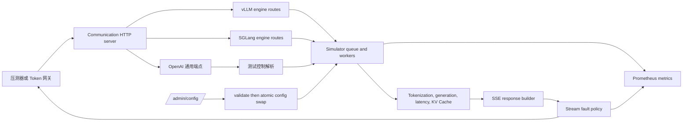

# llm-d-inference-sim 流量模拟实施方案与计划

> 状态：实施前方案
>
> 依据：[流量模拟设计方案](llm-d-inference-sim-traffic-simulation-design.md)
>
> 范围：将设计方案转化为可合并、可验证的仓库内实现；不包含 Token 网关自身的实现或生产环境部署。

## 1. 实施结论

采用“先复用、后扩展”的实施路径。

当前项目已经提供 OpenAI 兼容接口、`/inference/v1/generate`、SSE、请求并发队列、TTFT/ITL、KV Cache、基础故障注入、`/admin/config` 原子配置更新和 vLLM Prometheus 指标。vLLM、vLLM-Ascend 和 SGLang OpenAI 场景首先通过独立配置 Profile 交付，不新增协议代码。

新增代码只覆盖现有能力不能表达的部分：

1. 受开关保护的请求级测试控制，包括逻辑 Prompt、缓存和输出 Token 覆盖。
2. 受配置和请求级控制的流式故障行为，包括卡顿、断流、usage 异常和 SSE 终止异常。
3. 独立的 `sglang` engine，承载 SGLang 原生 HTTP 接口，并复用现有请求处理、排队、时延和指标数据面。
4. Profile、场景、指标和压测结果的可复现交付物。

不按设计文档中建议的 `pkg/protocol/` 建新并行协议层。仓库已具有 `pkg/engine` 的引擎扩展点：每个 engine 管理自己的默认值、配置校验、HTTP/gRPC 路由。SGLang 应作为该扩展点的第二个实现，公共 OpenAI 路由继续留在 `pkg/communication`。

## 2. 当前能力与实施差距

| 目标能力 | 当前实现 | 实施动作 |
| --- | --- | --- |
| vLLM、vLLM-Ascend、SGLang OpenAI | OpenAI 路由在 `pkg/communication/http.go`，模型、时延和队列可配置 | 增加 Profile 和契约测试，不增加新协议 |
| 逻辑 Token 精确控制 | `/v1/completions` 可传 Token ID；其他接口依赖 tokenizer 与生成器 | 增加受保护的请求级覆盖，统一影响 usage、上下文校验、TTFT 和输出长度 |
| 时延和并发退化 | `pkg/simulator/latencies.go`、worker queue 已实现 | Profile 配置并用直压数据校准；不重写时延模型 |
| 基础错误 | 概率性 `failure-injection-rate` 和 `X-Return-Error` | 保留原语义，新增流过程故障配置 |
| 流式事件 | `pkg/communication/http.go` 负责 chunk、usage、`[DONE]` 和 flush | 在传输层建立故障发送策略，避免污染 token 生成核心 |
| 运行时切换 | `Configuration.Update` + `SimContext.ApplyConfigUpdate` 使用原子配置指针 | 将场景字段纳入同一 copy-validate-swap 流程 |
| SGLang 原生接口 | 无 | 新增 `pkg/engine/sglang`、请求/响应适配器和 HTTP 路由 |
| 指标 | 已有 vLLM 风格队列、TTFT、ITL、E2E、Token 和缓存指标 | 增加低基数的 profile、scenario、engine 信息指标和故障计数 |

## 3. 目标架构



请求以到达时生效的不可变快照执行。HTTP 层读取全局场景和请求头后生成 `SimulationOverrides`；请求上下文持有该副本。之后的管理接口更新只影响新请求，不会改变已经排队或正在流式输出的请求。这既保证单个响应前后一致，也保留当前 `atomic.Pointer[Configuration]` 的运行时更新模型。

## 4. 配置和控制面设计

### 4.1 Profile 与 Scenario

Profile 是启动时配置，用于定义引擎身份和稳定的性能画像。场景是 Profile 上可通过 `/admin/config` 原子更新的运行时覆盖。每个 Profile 一个进程或 Deployment；同一进程同一时间只启用一个 Scenario。

建议提交以下非代码配置样例，名称和镜像标签在实际部署仓库中固化：

```text
examples/traffic-simulation/profiles/
  vllm-zero-delay.yaml
  vllm-normal-chat.yaml
  vllm-ascend-normal-chat.yaml
  sglang-openai-normal-chat.yaml
  sglang-native-normal-chat.yaml
examples/traffic-simulation/scenarios/
  overloaded.json
  midstream-disconnect.json
  missing-usage.json
  slow-decode.json
```

Profile 必填 `engine`、`model`、`served-model-name`、`seed`、`max-model-len`、`max-num-seqs`、队列长度和 `latencies`。Scenario 只允许变更已标记为 `admin:"configurable"` 的字段。模型、端口、队列容量和 tokenizer 不允许运行时修改，避免需要重建 worker、HTTP server 或数据集。

新增配置分组：

```yaml
traffic-simulation:
  profile: vllm-normal-chat
  scenario: default
  enable-test-controls: false
  stream-faults:
    disconnect-rate: 0
    disconnect-after-chunks: 0
    stall-rate: 0
    stall-after-chunks: 0
    stall-duration: 0s
    omit-done-rate: 0
    omit-usage-rate: 0
    corrupt-usage-rate: 0
```

`profile` 只作为观测身份，不触发配置文件加载；`scenario` 作为当前运行场景名称。所有 rate 都是 `0..100` 的整数，所有 chunk 序号必须非负，`stall-duration` 必须为正且只在启用 stall 时出现。`Configuration.Copy`、YAML/JSON 折叠、`Update`、`Validate` 和 `MarshalCleaned` 必须同时支持该分组，保持现有嵌套配置的行为一致。

### 4.2 请求级测试控制

仅当 `enable-test-controls: true` 时，HTTP 层解析下列请求头；未开启时忽略这些头并记录 debug 日志，不改变常规 API 行为。

| 请求头 | 语义 | 约束 |
| --- | --- | --- |
| `X-Mock-Prompt-Tokens` | 本请求的逻辑 Prompt Token 数 | `0..max-model-len` |
| `X-Mock-Cached-Tokens` | 本请求逻辑缓存命中 Token 数 | `0..prompt_tokens` |
| `X-Mock-Output-Tokens` | 强制输出长度 | `0..max-model-len-prompt_tokens` |
| `X-Mock-TTFT` | 覆盖首 Token 等待时间 | 合法 Go duration，非负 |
| `X-Mock-ITL` | 覆盖每个输出 token 的等待时间 | 合法 Go duration，非负 |
| `X-Mock-Disconnect-After-Chunks` | 发送指定数量响应 chunk 后断开 | 大于零 |
| `X-Mock-Omit-Done` | 省略 SSE `[DONE]` | 布尔值 |
| `X-Mock-Omit-Usage` | 省略最后 usage chunk | 布尔值 |
| `X-Mock-Corrupt-Usage` | 在最终 usage 中制造确定性错误 | 布尔值 |
| `X-Mock-Stall-After-Chunks`、`X-Mock-Stall-Duration` | 在指定 chunk 后暂停 | 两项一起提供 |

解析失败返回 400，错误信息指出请求头和值；不静默降级。请求头优先级高于 Scenario，Scenario 高于 Profile。`X-Return-Error` 保持现有的无开关行为，避免破坏已存在的测试契约。

`SimulationOverrides` 作为 endpoint 请求的运行时元数据，而不是修改请求 JSON wire struct。有效 Token 数由一个集中 helper 提供，供以下地方共同使用：上下文窗口验证、KV Cache 统计、TTFT 计算、usage、输出生成和指标。这样避免“usage 变了但时延和输出仍使用真实 tokenizer 数”的不一致。

输出文本仍从当前 dataset/tokenizer 获得，但在固定输出模式下截断或扩展到目标 token 数；`ignore_eos` 只影响原有行为，不能覆盖显式的 `X-Mock-Output-Tokens`。如果 tokenizer 不能产生足够文本，响应应返回内部错误而不是报告错误的 usage。

### 4.3 管理接口与隔离

`/admin/config` 继续仅接受部分更新，响应返回生效后的脱敏配置及当前 profile/scenario。每次成功修改在 INFO 级别记录 profile、旧 scenario、新 scenario 和变更字段，绝不记录认证信息或完整请求体。

鉴权、mTLS、端口隔离和 NetworkPolicy 属于部署层，不在模拟器新增一套身份系统。交付 Kubernetes 示例时，数据端口只开放给网关，管理端口由独立 Service 或反向代理限制给测试控制器；不通过公网 Ingress 暴露管理接口。

## 5. 数据面实现设计

### 5.1 固定 Token 和时延

实现顺序如下：

1. 在 `pkg/communication/http.go` 的通用 `handleHTTP` 中解析控制头，并在调用 `Simulator.HandleRequest` 前附加覆盖值。
2. 在 `pkg/endpoint` 中向各请求类型共享的基础数据增加 overrides，并在 `BuildRequestContext` 时冻结它们。
3. 在 `pkg/endpoint/request.go` 将目前的 `getNumberOfPromptTokens` 使用点替换为“有效 Prompt Token”访问器；缓存 Token 同样从有效值读取。
4. 在 `pkg/simulator/context.go` 的 `simulateTTFT` 和 `simulateInterTokenLatency` 读取请求覆盖值；未提供时保留 `latencyCalculator` 行为。
5. 在响应上下文创建前一次性计算有效 usage，确保流式与非流式使用同一个 `api.Usage`。

逻辑 Token 不分配等量 KV 数据，也不强制 tokenizer 接收等量文本。KV Cache 的 block 计算必须只使用明确的“物理 token”或“逻辑 token”之一：本项目用于网关压力模拟时选择逻辑 token，并在配置文档中说明该选择。所有 Prefix Cache 指标与 `cached_tokens` 必须以同一数值为准。

### 5.2 SSE 故障注入

流式故障是 HTTP 传输行为，因此放在 `pkg/communication`，位置在 response builder 产生 SSE frame 之后、写入 `bufio.Writer` 之前。它接收每请求冻结的 `StreamFaultPolicy`，维护已写 chunk 计数，并返回三种明确结果：继续、等待后继续、终止流。

正常事件顺序仍由现有 `finalizeStream` 负责：finish chunk、可选 usage、可选 `[DONE]`。故障策略的规则如下：

| 行为 | 触发点 | 写入结果 | worker 和指标处理 |
| --- | --- | --- |
| stall | 指定 chunk 成功 flush 后 | 等待指定时长再继续 | 记录 stall 次数和时长；客户端关闭则立刻结束 |
| disconnect | 指定 chunk 成功 flush 后 | 关闭 pipe，不写 error frame、usage 或 `[DONE]` | 标记中途断流，不把请求记为成功 |
| omit usage | `finalizeStream` | 跳过 usage frame | 保留 finish 和 `[DONE]` |
| corrupt usage | `finalizeStream` | 返回确定性错误 usage，正文不变 | 记录 usage_corrupted_total |
| omit done | `finalizeStream` | 最后一个业务 frame 后 EOF | 不额外写错误 frame |

客户端写失败和 context 取消必须停止从 channel 消费并启动现有 drain 机制，使 worker 可以完成且队列名额最终归还。实现前先补一个可取消的 stream writer 或 request-liveness 抽象；不能在已有 `io.Pipe` goroutine 中仅 return 而让生产者阻塞。

非流式请求不应用流式故障；控制头存在时返回 400，防止测试者误认为故障已生效。首字节超时通过 TTFT 覆盖表达，不另建相同能力。

### 5.3 SGLang 原生 engine

新增 `sglang` engine，并保持 OpenAI 通用接口由通信层自动注册。建议目录如下：

```text
pkg/engine/sglang/
  sglang.go             # Engine，默认值和名称
  flags.go              # SGLang 专属配置与解析
  validate.go           # engine 配置校验
  transport.go          # 原生路由注册
  generate.go           # /generate 请求、响应和 stream 编码
  info.go               # model_info、server_info、health_generate
  score.go               # /v1/rerank 与 /v1/score
  *_test.go
  testdata/             # 脱敏的版本化 Golden fixture
```

同时修改 `pkg/engine/engine.go` 的 registry，将 `sglang` 注册为可选 engine。SGLang 不注册 vLLM gRPC service；`BindGRPC` 返回 false。`Engine.ApplyDefaults` 只设置 SGLang 产生或校验的默认值，不修改共享字段。

`POST /generate` 不直接复用 vLLM `/inference/v1/generate` 的 wire struct，因为 `text`、`sampling_params.max_new_tokens` 和 SGLang SSE 格式不同。适配器将其转换为内部 `endpoint.Request`，调用同一个 `Processor.HandleRequest`，再将 `ResponseInfo` 编码为指定版本的 SGLang 响应。`stream: true` 的累计 `text` 与增量 `text` 由配置 `sglang.stream-text-mode` 选择；每个模式都有独立 fixture，默认值以采集的目标 SGLang 版本为准。

第一批原生路由和行为：

| 路由 | 实现 |
| --- | --- |
| `POST /generate` | 文本生成；普通和流式；支持 `text`、`sampling_params`、`stream` |
| `GET /model_info` | 返回稳定的模拟模型、tokenizer、上下文长度和 generation capability |
| `GET /get_model_info` | 调用 `/model_info` 的同一构造逻辑 |
| `GET /server_info` | 仅返回已知模拟配置和 profile，不伪造未实现调度状态 |
| `GET /health_generate` | 提交一个一 token 的内部健康请求；排队、时延和失败可被观测 |
| `POST /tokenize`、`POST /detokenize` | 复用 tokenizer；先确认 wire 契约再添加 adapter |
| `POST /v1/rerank`、`POST /v1/score` | 由 `seed + request_id + model` 生成确定性得分 |

Reasoning 和 Tool Call 在 OpenAI 兼容接口沿用现有 endpoint 行为。SGLang 原生协议只在已采集 fixture 证明字段和事件定义后加入，不猜测未固定的版本行为。

### 5.4 可观测性与确定性

保留现有 vLLM 兼容指标及其 model 标签。新增指标采用低基数标签，不接受 request ID、用户、完整模型路径或任意请求头作为标签：

```text
llmd_simulation_info{engine,profile,scenario} 1
llmd_simulation_stream_faults_total{profile,scenario,type}
llmd_simulation_test_control_total{profile,scenario,control,result}
llmd_simulation_client_cancelled_total{profile,scenario}
llmd_simulation_usage_anomalies_total{profile,scenario,type}
```

每个请求的伪随机选择使用稳定的派生种子：`hash(global_seed, request_id, displayed_model, scenario)`。它只用于本请求的故障、生成长度、SGLang score 和内容选择，不能共享全局可变随机状态。相同输入、Profile、Scenario 和请求 ID 必须产生相同状态码、usage、chunk 边界和故障点。

## 6. 分阶段实施计划

每个里程碑是可独立评审和回滚的工作单元。任何非平凡编码工作开始前，应按仓库规则关联一个 issue；以下编号是建议的 issue/PR 切分，不代表已经创建。

### M0：协议基线与交付边界

**目标：** 固定后续实现比较的版本和事实，不改动运行时代码。

1. 固定目标 vLLM、vLLM-Ascend 和 SGLang 版本及镜像 digest。
2. 为普通、SSE、Tool Call、Reasoning、错误、usage 和模型查询采集最小请求/脱敏响应。
3. 将 fixture 按 engine、版本和路由存入对应 package 的 `testdata`，并记录采集命令、模型、采集日期和规范化规则。
4. 定义字段级比对规则：动态 ID、时间戳和部署地址可忽略；JSON 字段、SSE 顺序、finish reason、usage 和 content type 必须比对。
5. 编写 `examples/traffic-simulation/README.md`，明确 Dummy tokenizer 用于容量测试，Render tokenizer 用于 Token 对账。

**完成标准：** fixture 回归测试在当前上游能力上通过或明确列出差异；每个未来新增接口有一份目标 wire contract。

### M1：Profile 和原有能力基线

**目标：** 不二开协议即可支持三个 OpenAI 兼容后端画像。

1. 增加 vLLM、vLLM-Ascend 和 SGLang OpenAI 的零时延与正常时延 YAML Profile。
2. 提供 ConfigMap、Deployment、Service 和 NetworkPolicy 示例，沿用已有 `deploy/` 的 render sidecar 模式；生产集群的资源值不写死为容量结论。
3. 编写配置加载测试，检查模型别名、`max-model-len`、队列和 latencies。
4. 编写直连 smoke：`/health`、`/health/ready`、`/v1/models`、流式和非流式 chat/completion、最终 usage。
5. 用零时延 Profile 做 simulator 直压，记录达到网关目标流量三倍所需的 CPU、内存、副本数和连接数。

**完成标准：** 三个 Profile 均能用同一 OpenAI 客户端访问；配置、文档和 smoke 在不加载模型权重的环境中运行。

### M2：可控 Token、时延和 Scenario

**目标：** 为网关计量、长上下文和超时测试提供可复现输入。

1. 在 `common.Configuration` 增加 `traffic-simulation` 配置并实现完整 validation、copy 和 `/admin/config` 更新。
2. 实现 `SimulationOverrides`、控制头解析及 400 validation。
3. 使有效 Token 数贯穿请求校验、KV Cache、时延、生成、usage 和 Prometheus。
4. 实现每请求 TTFT/ITL 覆盖，且不影响其他并发请求。
5. 增加 scenario 名称到 info metric、审计日志和 admin 响应。

**先写的测试：**

- 禁用控制开关时各头无副作用；启用后每个非法值均返回 400。
- `prompt=4096,cached=2048,output=1024` 的流式和非流式 usage 完全相同，TTFT 按未缓存的 2048 token 计算。
- 输出 Token、上下文上限、0 值和边界值；多 choice 与 text completion 拆分请求。
- 同时发出两个具有不同覆盖值的请求，确认没有串扰。
- `POST /admin/config` 在错误更新后保持旧配置，在成功更新后新请求观察新 Scenario。

**完成标准：** 同一 seed/request ID 的结果可重放，固定长度请求的 completion token 误差为零。

### M3：流式故障与取消语义

**目标：** 覆盖网关的 idle timeout、断流、usage 缺失与协议完整性处理。

1. 实现 `StreamFaultPolicy` 与全局/请求覆盖的优先级解析。
2. 把 policy 插入每次成功 flush 后和 `finalizeStream`，实现 stall、disconnect、omit usage、corrupt usage 和 omit done。
3. 补充 client disconnect 检测、channel drain 和 worker 释放验证。
4. 为每个故障增加计数指标，区分配置触发、请求头触发和真实写入失败。
5. 在示例中提供 midstream、slow decode、missing usage 场景。

**先写的测试：**

- 使用可控 writer 断言精确 SSE 帧序列、flush 次数、EOF 位置和没有意外 error frame。
- disconnect 后不出现 usage 与 `[DONE]`，等待队列名额在请求结束后归还。
- stall 可被客户端 context 取消，测试不依赖实际长 sleep。
- omit usage 只影响使用了 `include_usage` 的最终 frame；非流式不受影响。
- corrupt usage 不改变正文 token、finish reason 或正常指标中的实际生成 token。
- 重复运行保持同一断开 chunk。

**完成标准：** 所有故障默认关闭，开启后只影响匹配请求；没有 goroutine、响应 channel 或并发名额泄漏。

### M4：SGLang 原生协议

**目标：** 用独立 engine 提供最小但可验证的 SGLang 原生面。

1. 注册 `sglang` engine，添加 flags、defaults、validation 和 transport 测试。
2. 实现 `/generate` request translation、非流式 response 和流式 encoder。
3. 基于 M0 fixture 实现累计/增量 `text` 模式，测试 role、finish reason、usage 和错误映射。
4. 实现 `model_info`、`get_model_info`、`server_info`、`health_generate`。
5. 在已确认 SGLang wire contract 后实现 tokenize/detokenize、rerank 和 score；每项保持单独 PR。
6. 编写 engine-level 集成测试，确认 SGLang engine 仍提供通用 OpenAI 路由，且不注册 vLLM gRPC。

**完成标准：** 所有已承诺路由均与固定目标版本 fixture 字段和事件顺序一致；未承诺的字段不伪造支持。

### M5：可观测性、校准和压测器契约

**目标：** 使测试结果可以解释、比较和复现。

1. 注册 simulation info、故障、取消和 usage anomaly 指标，并为标签基数和说明写单元测试。
2. 提供 Prometheus recording rules 或 dashboard 字段映射：流量、TTFT/ITL/E2E、错误、资源和网关额外延迟。
3. 固定直压命令和 SGLang `bench_serving` 版本/参数；将请求率、并发、Profile、Scenario、镜像 digest、seed 与压测器版本写入结果元数据。
4. 补一个最小 Go 测试驱动器，仅在现有压测器不能采集时实现：TTFB 与首内容 Token、逐 chunk 时间、usage 对账、慢读与取消。它不承担通用压测平台职责。
5. 运行零时延基线、4K/1K 混合场景、故障场景、8 小时 Soak；24 小时 Soak 作为发布前运行手册步骤，不作为常规 CI。

**完成标准：** 任一测试结果可由 Profile、Scenario、seed、压测命令和版本重建；模拟器不是被测网关容量的未知瓶颈。

## 7. 测试层次和验收

| 层次 | 范围 | 必须验证 |
| --- | --- | --- |
| unit | config、header parser、seed、token/usage helper、SGLang struct、fault policy | 边界、非法输入、优先级、确定性 |
| package integration | endpoint、simulator、communication | queue、TTFT/ITL、取消、SSE frame 顺序、admin 原子更新 |
| HTTP contract | 各 engine 的真实 HTTP server | status、header、JSON、SSE、usage、故障 EOF |
| fixture regression | vLLM/vLLM-Ascend/SGLang 目标版本 | 规范化后的 wire contract |
| performance | simulator 直连、再经网关 | 零时延三倍余量、Chunk 吞吐、资源回落 |
| soak | 8 小时回归，24 小时发布前 | 内存、goroutine、FD、连接和错误不单调泄漏 |

实现期间每个变更至少运行相关 package 测试；合并前运行 `make presubmit`。压测、Soak 和真实引擎采集作为带环境依赖的手动/CI nightly job，输出应附带环境元数据，不能以单次结果宣布通用容量。

最终验收按照设计文档的数值目标执行，并额外要求：

1. 零时延直压的已记录吞吐至少为目标网关吞吐的三倍，或清楚记录横向扩容后的等效余量。
2. 固定 Token 流式/非流式、缓存 Token 与 usage 对账误差为零。
3. 每类 SSE 故障都可通过 Profile/Scenario 或请求头确定性复现。
4. 客户端取消、中途断流和 Scenario 更新后，运行请求、等待请求和 goroutine 在稳定窗口内回落。
5. 每个公开 HTTP 路由有请求、成功、错误和流式契约测试；SGLang 路由另有版本化 fixture。

## 8. 推荐提交顺序和文件边界

| PR | 主要文件 | 不应混入 |
| --- | --- | --- |
| 1：Profile 示例与基线文档 | `examples/traffic-simulation/`、`docs/` | 新协议或运行时代码 |
| 2：Scenario 配置 | `pkg/common/config*`、`pkg/simulator/context*`、配置测试 | SSE 行为变更 |
| 3：请求级控制 | `pkg/communication/http.go`、`pkg/endpoint/`、`pkg/simulator/` 及同包测试 | SGLang 路由 |
| 4：SSE 故障 | `pkg/communication/`、指标和测试 | 其他协议重构 |
| 5：SGLang generate 和 info | `pkg/engine/sglang/`、`pkg/engine/engine.go` | rerank/score 等后续接口 |
| 6：SGLang 扩展接口 | `pkg/engine/sglang/` 和 fixtures | 无关 API 扩展 |
| 7：压测/观测交付 | examples、dashboard/rules、运行手册 | 运行时语义改动 |

每个 PR 更新当前状态文档和对应配置说明。协议 fixture 只包含经脱敏的测试内容；不提交生产请求、真实 API key、用户数据或长原始响应。

## 9. 依赖、风险和决策门

| 决策或风险 | 在哪个里程碑前解决 | 处理方式 |
| --- | --- | --- |
| 目标 SGLang 版本与原生 SSE 语义不唯一 | M0 | 明确版本、采集 fixture；没有 fixture 不实现该字段 |
| 逻辑 Token 是否驱动 KV block 事件 | M2 | 选择逻辑 Token 并将该语义写入 docs 和测试；若网关需物理事件，另立 issue |
| 固定输出长度与当前 dataset/tokenizer 不匹配 | M2 | 用当前 tokenizer 生成并截取，无法满足时显式失败；不伪造 usage |
| SSE writer 取消无法可靠传播 | M3 | 先写阻塞/取消复现；若现有 pipe 模型不够，最小化重构 writer 生命周期后再加故障 |
| Profile 标签导致指标高基数 | M5 | 仅允许配置白名单名称，不接收任意 header 值 |
| 模拟器自身成为瓶颈 | M1、M5 | 零时延直压、CPU profile、固定副本数和三倍余量 |
| 真实引擎延迟随硬件或版本变化 | M0、M5 | 将采样数据和镜像 digest 同 Profile 版本化，定期重新校准 |

以下内容明确不在本计划内：真实 GPU/NPU 性能、模型质量、自动下载用户媒体、生产级认证系统、统一 Scenario CRD、真实网络损伤模拟，以及未经 fixture 证明的 SGLang API。它们需要独立的需求和验收标准。

## 10. 首次实施的执行清单

1. 创建并关联 M0 issue，固定首个支持的 vLLM、vLLM-Ascend、SGLang 版本。
2. 采集和脱敏最小 fixture，确认 `/generate` 的实际流式文本模式。
3. 以 M1 的三个 OpenAI Profile 验证当前 simulator 和网关的直连基线。
4. 依次完成 M2、M3 和 M4；每一步先让契约测试失败，再实现最小通过改动。
5. M5 记录性能、Soak 和校准结果，只有在模拟器余量满足条件后将其用于网关容量结论。
